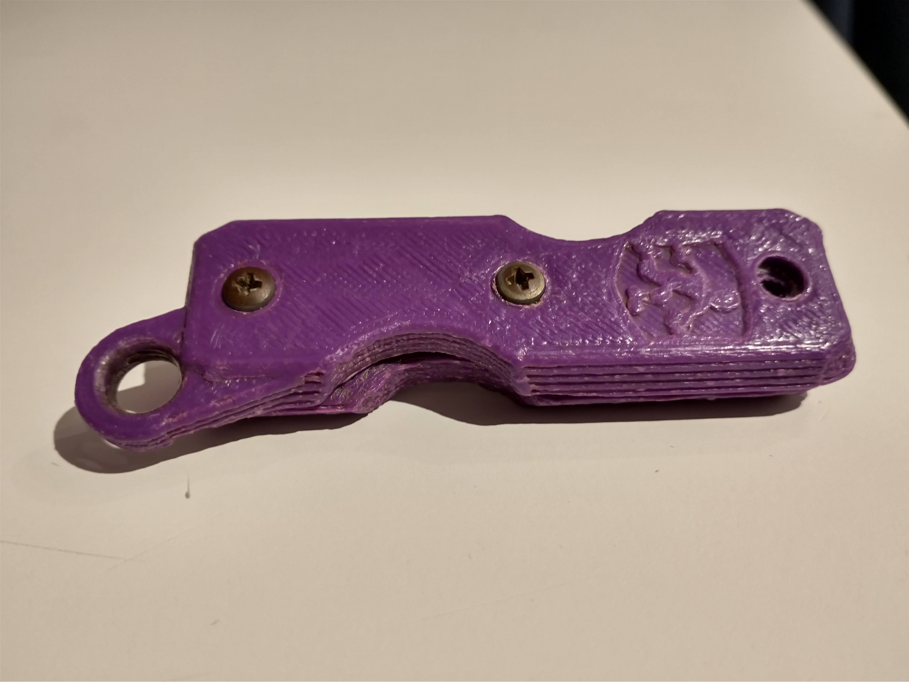

# CadQuery Parametric Swiss Army/Breech Lock Key Holder

I designed this fun key holder to give you easy access to your keys with a  compact, quiet, and interesting design. 

This idea was originally inspired by the [Proteus Key Holder](https://www.thingiverse.com/thing:2749745/files) originally posted to thingiverse in 2018. Shortly after it was posted, I saw it while roaming thingiverse, and immedieately sliced it and fired it off to my aging Anet A8 clone (which I had salvaged from a pile of junk on the sidewalk, while walking on a rainy day in NYC). This printer needed a lot of TLC, and while I was able to get a successful print, it was pretty ugly. Nonetheless, I dropped my keys in, screwed it up, and it's been with me every day in my pocket since 2018. It has held up remarkably well, but I decided it was about time for an upgrade.

## The Next Generation

I went seaching my usual spots for a new and improved design: Printables, Thingiverse. After a good bit of searching I finally came across these two designs for a folding key holder: [the original](https://www.thingiverse.com/thing:755772), and [the remix](https://www.thingiverse.com/thing:3694222). I decide to print the remix as I liked several of the design changes its creator had made to the original. I printed it out and tried it and found two issues: 1) one of the segments could not be printed without supports 2) it did not fit the size and number of keys that I need to carry.

## CadQuery FTW

I've really been enjoying designing models in CadQuery, so I gave it a go. I've kept most of the design changes from the remix, but made some of my own tweaks as well. The best part is that this design is now totally parametric. By tweaking a few variables to adjust for: length of the keys, thickness of the keys, whether you want a hole for a keyring. The design can now be adapted to anyone's needs. 

## Customizing The Design

If you want to get started customizing this design, I recommend you go learn more about [CadQuery](https://github.com/CadQuery/cadquery) on Github and then go download the [CadQuery GUI Editor](https://github.com/CadQuery/cq-editor).

Note: You will need a few other things to get up and running:
- Make sure your development environment has the [cq_warehouse library](https://github.com/jpoles1/cq_warehouse) installed. This is necessary for rendering and cutting out the bolts/nuts in this design.
- You will also need a copy of my [cq_style library](https://github.com/jpoles1/cq_style). There are two easy ways to get it setup: 
    1) My preferred approach to setting up my CadQuery development environment is to setup a CadQuery project directory (`mkdir ~/cadquery_projects && cd ~/cadquery_projects`). I clone the cq_keys repository into this folder (`clone https://github.com/jpoles1/cq_keys.git`) and then clone the cq_style repository into this folder (`clone https://github.com/jpoles1/cq_style.git`). Now the cq_keys design will import cq_style from its parent directory. This directory structure makes it easy to develop interconnected design projects!
    2) You can include [this file](https://github.com/jpoles1/cq_style/blob/master/cq_style.py) in your project folder (and change the cq_style import).

## More Real World Images

